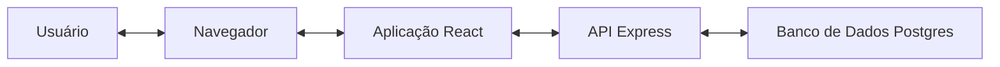
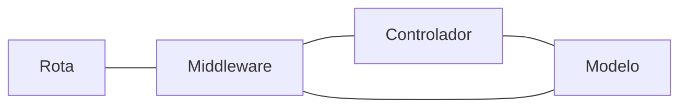

# Diagrama de arquitetura

Esse documento esboça como os componentes da aplicação interagem.

## Geral

- **Usuário**
  - Utiliza a aplicação.
- **Navegador**
  - Renderiza o frontend da aplicação e recebe interações do usuário.
- **Aplicação React**
  - Se comunica com a API do backend para realizar requisições e troca de dados.
  - Formata e exibe no navegador os dados recebidos da API.
- **API Express**
  - Interage com o banco de dados para armazenar e recuperar os dados dos
  usuários e das tarefas.
  - Interage com o frontend devolvendo os dados solicitados.
- **Banco de Dados Postgres**
  - Guarda os dados da aplicação.

## API Express

- **Rota**
  - Assimila os middlewares e controladores correspondentes aos endpoints da
  API.
- **Middleware**
  - Executa verificações, às vezes utilizando informações do banco de dados, e,
  caso não haja nenhum percalço, passa a execução para o controlador.
- **Controlador**
  - Responsável por obter e tratar dados do modelo, para então enviar a resposta correspondente a cada solicitação.
- **Modelo**
  - Realiza o salvamento e recuperação de informações no banco de dados.
