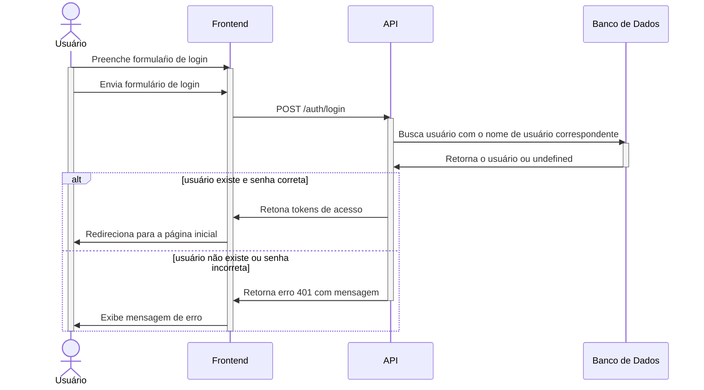
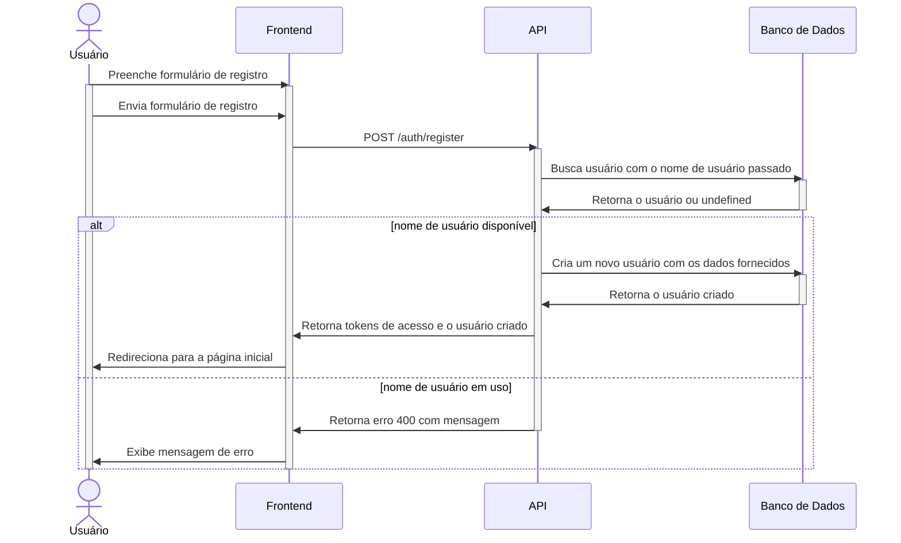
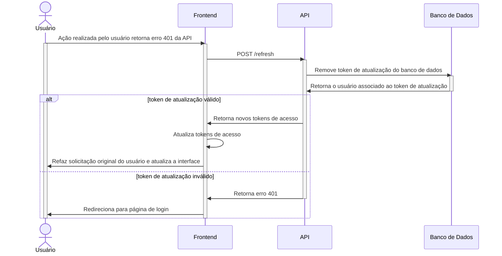
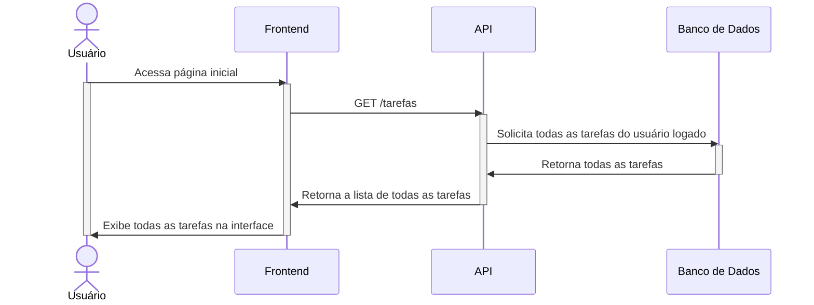
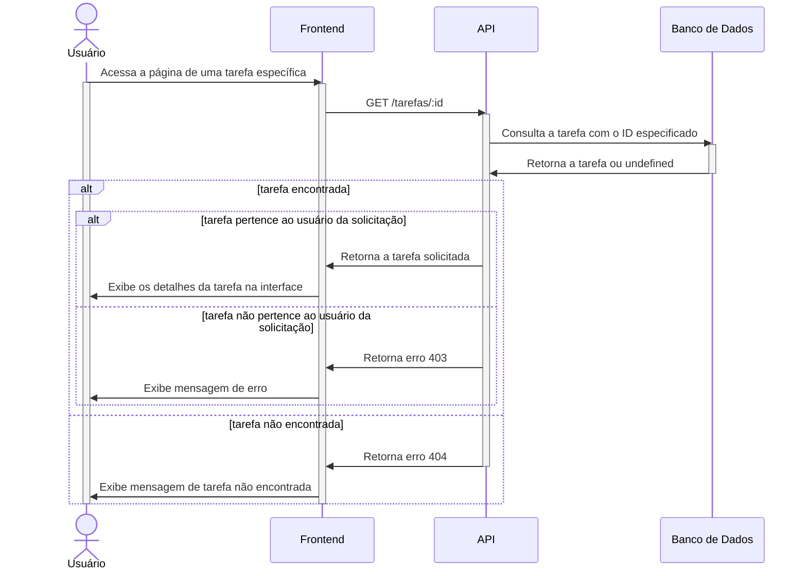
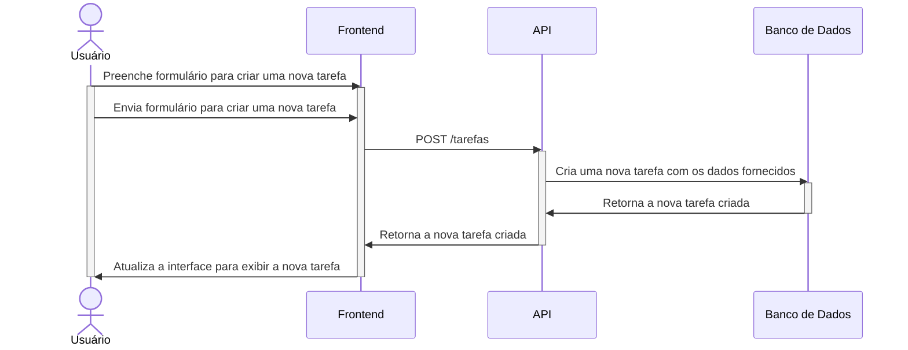
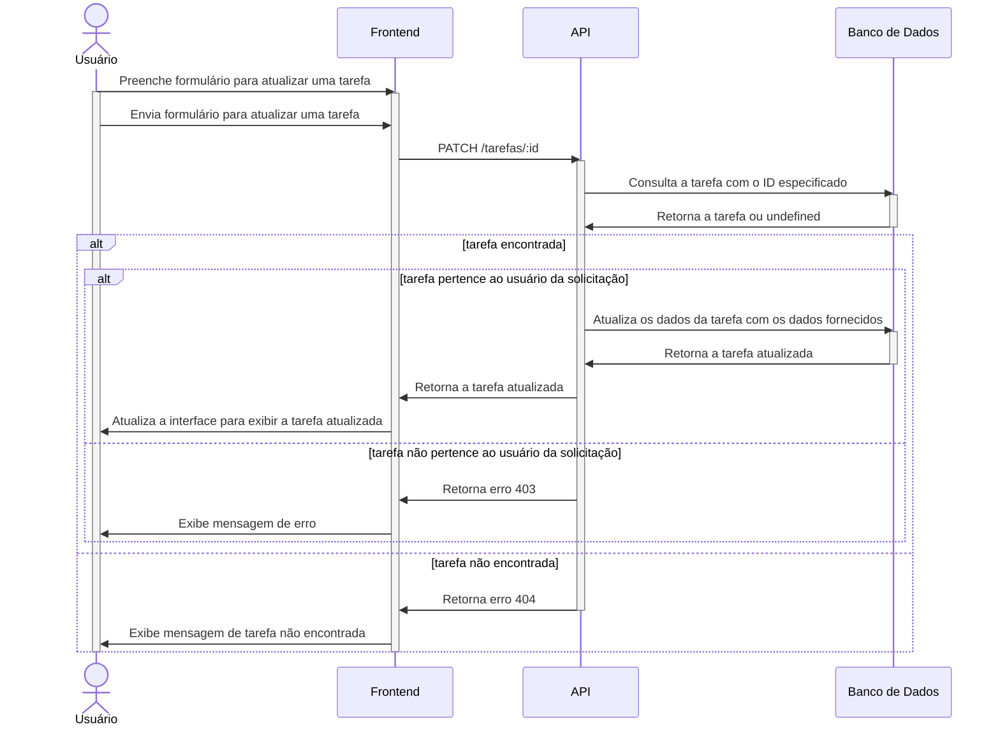
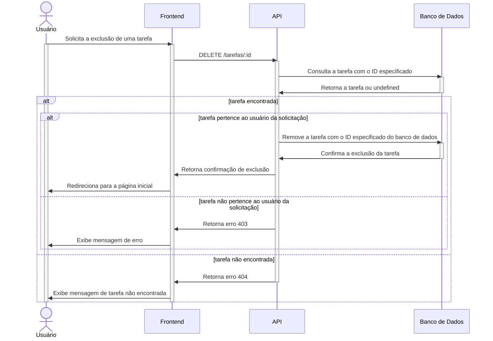

# Diagramas de sequência

Esse documento esboça o fluxo de dados entre as diferentes entidades da
aplicação.

## Autenticação

### Login

### Cadastro

### Atualização de tokens

## Tarefas

### Busca de Todas as Tarefas

### Busca de uma Tarefa Específica

### Criação de uma Nova Tarefa

### Atualização de uma Tarefa

### Exclusão de uma Tarefa

